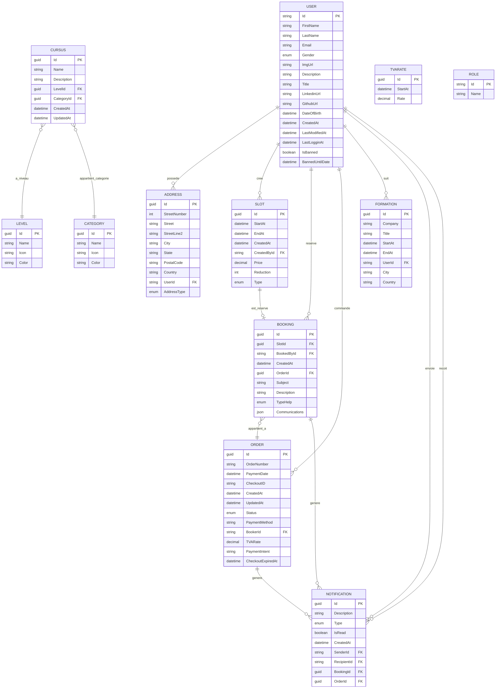
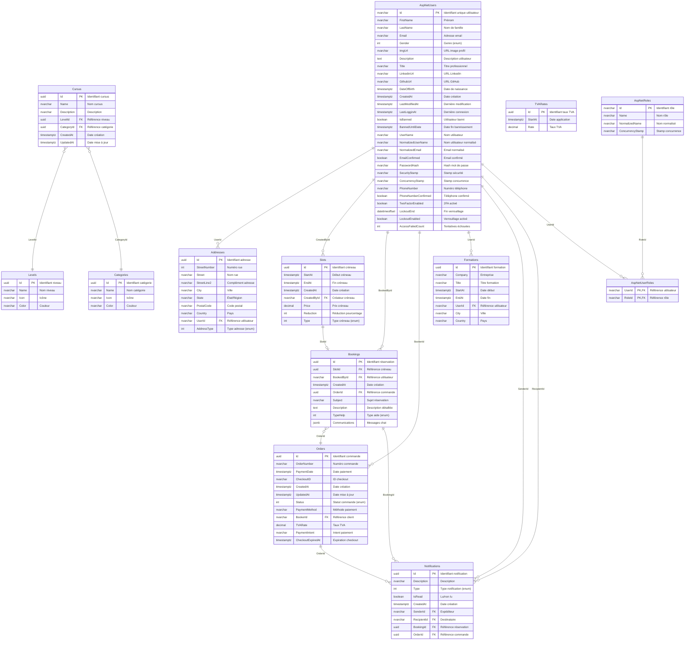

# TerminalApi - Documentation du Projet

## Architecture de la Base de Données

Cette section présente l'architecture de la base de données du projet TerminalApi, incluant le Modèle Conceptuel de Données (MCD) et le Modèle Logique de Données (MLD).

### Modèle Conceptuel de Données (MCD)

Le MCD représente la structure conceptuelle de notre système de gestion de formations et réservations en ligne. Il illustre les entités principales et leurs relations métier.



#### Description des Entités Principales

**USER (Utilisateur)** : Entité centrale du système représentant les utilisateurs (étudiants, formateurs, administrateurs). Chaque utilisateur peut avoir plusieurs rôles et possède un profil complet avec informations personnelles et professionnelles.

**SLOT (Créneau)** : Représente les créneaux horaires disponibles créés par les formateurs. Chaque créneau a un prix, peut avoir une réduction et est typé selon le service proposé.

**BOOKING (Réservation)** : Entité de liaison entre un utilisateur et un créneau. Une réservation contient les détails de la demande d'aide et peut inclure des communications via chat.

**ORDER (Commande)** : Regroupe une ou plusieurs réservations pour le processus de paiement. Gère le cycle de vie commercial avec statuts, méthodes de paiement et TVA.

**CURSUS** : Représente les parcours de formation structurés par niveaux et catégories, permettant une organisation pédagogique cohérente.

### Modèle Logique de Données (MLD)

Le MLD présente l'implémentation technique de la base de données avec les tables, types de données et contraintes réelles.



#### Spécifications Techniques

**Système d'Authentification** : Utilisation d'ASP.NET Core Identity avec tables `AspNetUsers`, `AspNetRoles` et `AspNetUserRoles` pour la gestion des utilisateurs et des autorisations.

**Types de Données** :

- `uuid` : Identifiants uniques pour les entités métier
- `timestamptz` : Horodatage avec fuseau horaire pour PostgreSQL
- `decimal(18,2)` : Précision monétaire pour les prix et taux
- `jsonb` : Stockage JSON binaire pour les communications chat
- `text` : Texte de longueur variable pour les descriptions

**Contraintes d'Intégrité** :

- Clés étrangères avec actions de suppression configurées (`CASCADE`, `RESTRICT`, `SET NULL`)
- Contraintes de longueur sur les champs texte
- Valeurs par défaut pour les champs optionnels
- Index sur les clés étrangères pour optimiser les performances

**Particularités du Modèle** :

- Relation 1:1 entre `Slot` et `Booking` (un créneau ne peut être réservé qu'une fois)
- Relation N:M entre `User` et `Role` via la table de liaison `AspNetUserRoles`
- Système de notifications polymorphe pouvant référencer différents types d'entités
- Gestion des adresses multiples par utilisateur avec typage (domicile, travail, facturation)
- Système de réductions et calculs de prix avec propriétés calculées

### Règles de Gestion

1. **Utilisateurs** : Un utilisateur peut avoir plusieurs rôles, plusieurs adresses et peut être temporairement banni
2. **Créneaux** : Seuls les formateurs peuvent créer des créneaux, qui ont un prix de base et une réduction optionnelle
3. **Réservations** : Une réservation lie un étudiant à un créneau spécifique et doit être associée à une commande pour être validée
4. **Commandes** : Regroupent une ou plusieurs réservations avec gestion du processus de paiement et application de la TVA
5. **Formations** : Historique des formations suivies par les utilisateurs avec localisation géographique
6. **Cursus** : Organisation pédagogique avec niveaux et catégories prédéfinis lors de l'initialisation de la base

---

# Test Run and report results

## Run Tests:

Dans le projet TerminalTest/TestIntegration, vous pouvez exécuter les tests unitaires en utilisant la commande suivante dans le terminal :

```bash
dotnet test --logger "trx;LogFileName=results.trx"
```

## Report Results:

Dans le projet TerminalTest/TestIntegration, vous pouvez générer un rapport de test en utilisant la commande suivante dans le terminal :

### pour installer le report generator global tool :

```bash
dotnet tool install -g dotnet-reportgenerator-globaltool
```

```bash
reportgenerator -reports:./TestResults/results.trx -targetdir:Report -reporttypes:Html
```

et ensuite , ouvrez le fichier `index.html` dans le dossier `Report` pour visualiser le rapport de test.
